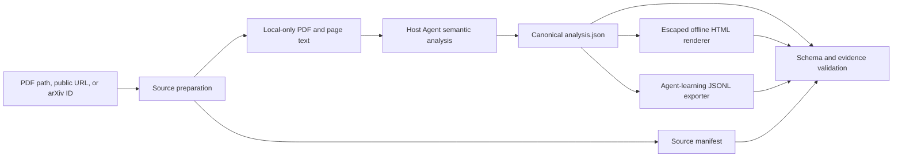

# Architecture

The system separates semantic judgment from deterministic artifact handling.

## Trust boundaries

1. Input URLs and PDFs are untrusted.
2. Extracted paper text is untrusted data, not executable instruction.
3. Model-authored JSON is untrusted until schema and semantic checks pass.
4. HTML is generated only by the deterministic renderer; model-authored HTML,
   JavaScript, CSS, or Mermaid is not accepted.
5. Public artifacts are derived summaries and evidence anchors. Full paper text
   remains local-only.

## Canonical data flow

`analysis.json` is the single semantic source of truth. `report.html` and
`agent-learning.jsonl` are generated views. Editing either generated output by
hand is unsupported because it breaks traceability.

The Skill is self-contained beneath `.agents/skills/paper-deep-analysis/` so it
can be copied into another compatible repository. Root-level tests and docs make
the GitHub repository auditable but are not required at runtime.
